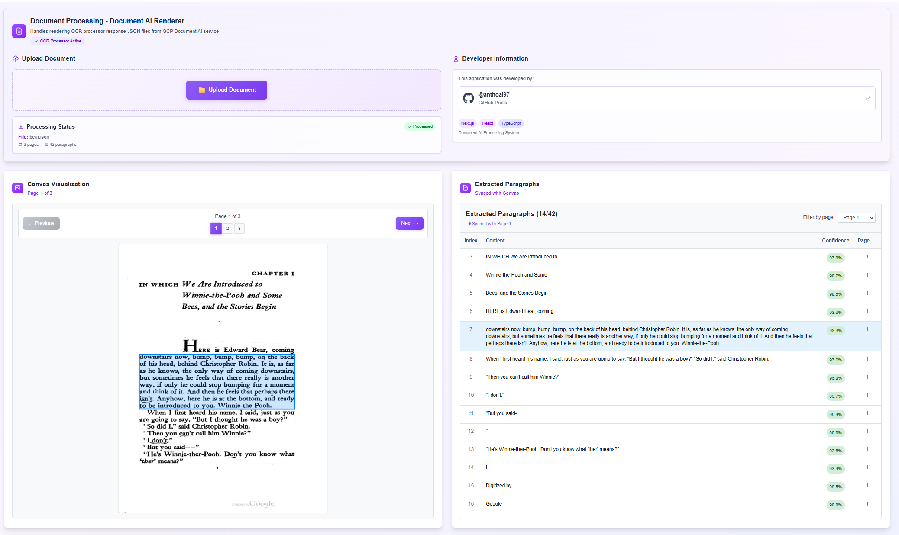

# Document AI Renderer

A powerful Next.js application that handles rendering OCR processor response JSON files from Google Cloud Platform (GCP) Document AI service. This tool provides an interactive canvas visualization and data table for processing and analyzing extracted document content.



## 🚀 Features

- **📄 Document Processing**: Upload and process JSON files from GCP Document AI OCR processor
- **🎨 Interactive Canvas**: Visualize documents with clickable paragraph highlighting
- **📊 Data Table**: Browse extracted paragraphs with synchronized page navigation
- **📱 Multi-page Support**: Handle documents with multiple pages seamlessly
- **🔄 Real-time Synchronization**: Canvas and table are synchronized for better user experience
- **💜 Beautiful UI**: Modern violet-themed interface with smooth animations
- **⚡ Client-side Processing**: No backend required, all processing happens in the browser
- **📱 Responsive Design**: Works perfectly on desktop and mobile devices

## 🛠️ Technology Stack

- **Framework**: [Next.js 14+](https://nextjs.org/) with App Router
- **Frontend**: [React 18](https://reactjs.org/) with TypeScript
- **Styling**: [Tailwind CSS](https://tailwindcss.com/) with custom violet theme
- **Canvas Rendering**: HTML5 Canvas API for document visualization
- **File Processing**: FileReader API for client-side JSON processing

## 📋 Prerequisites

- Node.js 18+ 
- npm or yarn package manager
- Modern web browser with HTML5 Canvas support

## 🚀 Getting Started

### Installation

1. Clone the repository:
```bash
git clone https://github.com/anthoai97/document-ai-render.git
cd document-ai-render
```

2. Install dependencies:
```bash
npm install
# or
yarn install
```

3. Run the development server:
```bash
npm run dev
# or
yarn dev
# or
pnpm dev
# or
bun dev
```

4. Open [http://localhost:3000](http://localhost:3000) in your browser.

## 📁 Project Structure

```
src/
├── app/
│   ├── page.tsx                 # Main application page
│   ├── layout.tsx              # Root layout
│   └── globals.css             # Global styles
├── components/
│   ├── DocumentViewer/         # Canvas visualization component
│   ├── DataTable/             # Paragraph data table component
│   ├── FileUpload/            # File upload component
│   └── index.ts               # Component exports
├── hooks/
│   └── useDocumentProcessor.ts # Document processing logic
├── types/
│   └── document.ts            # TypeScript type definitions
└── utils/
    └── documentUtils.ts       # Utility functions
```

## 📖 Usage

### 1. Upload JSON File
- Click on the upload area or drag and drop your GCP Document AI JSON file
- Supported format: JSON files from Google Cloud Document AI OCR processor

### 2. View Document
- The canvas will render the document with interactive paragraph regions
- Click on any paragraph to highlight it and view details
- Use page navigation controls for multi-page documents

### 3. Browse Data
- The data table shows all extracted paragraphs
- Click on any row to highlight the corresponding area on the canvas
- Filter paragraphs by page using the page controls
- Pages are automatically synchronized between canvas and table

### 4. Navigate Multi-page Documents
- Use the page navigation buttons to switch between pages
- Selected paragraphs automatically navigate to their respective pages
- Page information is displayed in both canvas and table headers

## 🎯 Supported File Format

The application expects JSON files with the following structure from GCP Document AI:

```json
{
  "pages": [
    {
      "pageNumber": 1,
      "dimension": {
        "width": 612,
        "height": 792
      },
      "image": {
        "content": "base64-encoded-image-data"
      },
      "paragraphs": [
        {
          "layout": {
            "textAnchor": {
              "textSegments": [
                {
                  "startIndex": "0",
                  "endIndex": "13"
                }
              ]
            },
            "confidence": 0.99,
            "boundingPoly": {
              "normalizedVertices": [
                {
                  "x": 0.1234,
                  "y": 0.5678
                }
              ]
            }
          }
        }
      ]
    }
  ],
  "text": "Full document text content..."
}
```

## 🎨 UI Features

- **Violet Theme**: Consistent purple/violet color scheme throughout the application
- **Responsive Design**: Adapts to different screen sizes and devices
- **Smooth Animations**: Hover effects and transitions for better user experience
- **Interactive Elements**: Clickable paragraphs, hover states, and visual feedback
- **Status Indicators**: Processing states, file information, and completion status

## 🔧 Customization

### Styling
The application uses Tailwind CSS with a custom violet theme. You can modify colors in:
- Component classes (violet-*, purple-*, indigo-*)
- Gradient backgrounds
- Border colors and hover states

### Canvas Settings
Canvas rendering can be customized in the DocumentViewer component:
- Highlight colors
- Border styles
- Animation timing
- Coordinate scaling

## 🤝 Contributing

1. Fork the repository
2. Create your feature branch (`git checkout -b feature/amazing-feature`)
3. Commit your changes (`git commit -m 'Add some amazing feature'`)
4. Push to the branch (`git push origin feature/amazing-feature`)
5. Open a Pull Request

## 📝 License

This project is licensed under the MIT License - see the [LICENSE](LICENSE) file for details.

## 🐛 Issues & Support

If you encounter any issues or have questions:

1. Check the [Issues](https://github.com/anthoai97/document-ai-render/issues) page
2. Create a new issue with detailed description
3. Include your environment details and steps to reproduce

## 🚀 Deployment

### Vercel (Recommended)
```bash
npm run build
vercel --prod
```

Built with ❤️ using Next.js and React | Powered by Google Cloud Document AI
